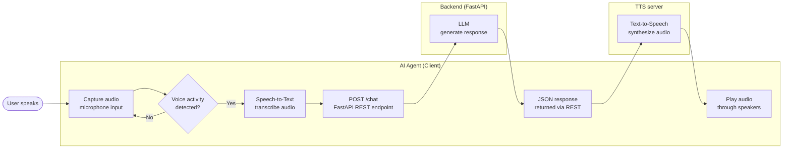

```mermaid
flowchart LR
    A([User speaks]) --> B[Capture audio<br/>microphone input]
    B --> C{Voice activity<br/>detected?}
    C -- No --> B
    C -- Yes --> D[Speech-to-Text<br/>transcribe audio]
    D --> F[POST /chat<br/>FastAPI REST endpoint]
    F --> G[LLM<br/>generate response]
    G --> H[JSON response<br/>returned via REST]
    H --> I[Text-to-Speech<br/>synthesize audio]
    I --> J[Play audio<br/>through speakers]

    subgraph Client["AI Agent (Client)"]
        B
        C
        D
        F
        H
        J
    end

    subgraph Server["Backend (FastAPI)"]
        G
        H
    end
    subgraph TTS["TTS server"]
        I
    end
```
