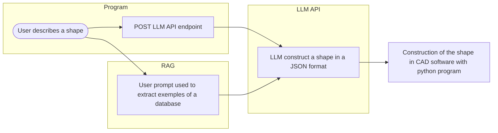

```mermaid
flowchart LR
    A([User describes a shape]) --> B[POST LLM API endpoint]
    B --> C[LLM construct a shape in a JSON format]
    C --> D[Construction of the shape in CAD software with python program]
    A --> F[User prompt used to extract exemples of a database]
    F --> C

    subgraph Client["Program"]
        A
        B
    end

    subgraph Server["LLM API"]
        C
    end
    subgraph RAG["RAG"]
        F
    end
```
